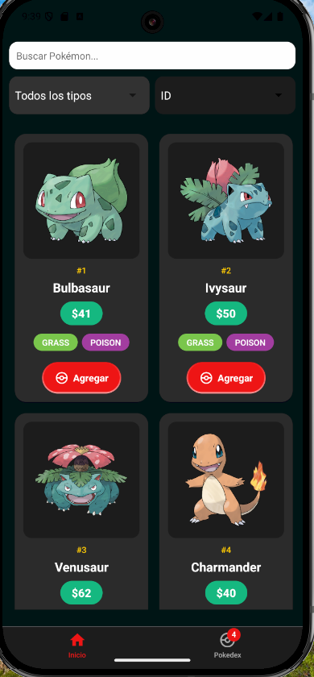
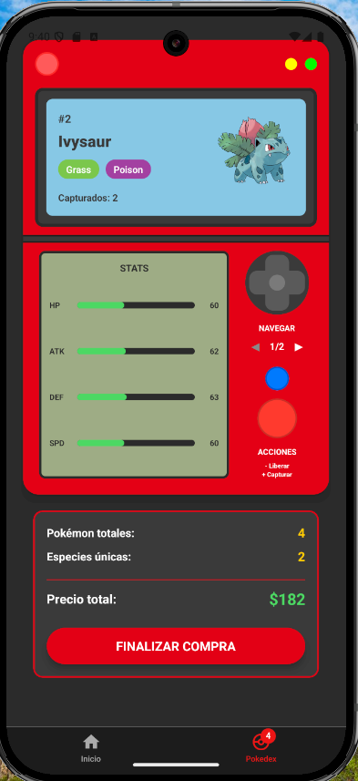

# ⚡ Pokédex App

¡Bienvenido a la **Pokédex App**! Esta es una aplicación móvil desarrollada en **React Native** que funciona como un catálogo interactivo de Pokémon. Además de explorar a tus criaturas favoritas, puedes añadirlas a un carrito de compras virtual.

---

## 🚀 Características Principales

* **Catálogo de Pokémon:** Explora un extenso catálogo de Pokémon con detalles relevantes de cada uno.
* **Carrito de Compras:** Agrega y gestiona tus Pokémon favoritos en un carrito. Puedes ajustar cantidades y ver el total de tu selección.
* **Arquitectura Limpia:** El proyecto sigue los principios de **Clean Architecture**, lo que garantiza un código modular, escalable y fácil de mantener.
* **Gestión de Estado con Redux:** Se utiliza **Redux Toolkit** para una gestión de estado predecible y centralizada, asegurando que los datos del catálogo y el carrito estén siempre sincronizados.

---

## 🏗️ Arquitectura y Decisiones Técnicas

Se ha implementado una arquitectura que combina Clean Architecture con Redux para la gestión del estado global.

### 🧩 Clean Architecture

La elección de Clean Architecture permite:

* Mayor separación de responsabilidades entre capas de la aplicación

* Mejor adherencia a los principios SOLID

* Código más mantenible y testeable

* Escalabilidad optimizada para futuras expansiones

* Independencia de frameworks y librerías externas

---

### 🔄 Redux para Estado Global

Se utilizó Redux específicamente para:

* Gestionar el estado complejo del carrito de compras de manera predecible

* Centralizar el estado de la Pokedex para facilitar su acceso desde múltiples componentes

* Implementar un flujo unidireccional de datos que mejora la trazabilidad

---

### 🎯 Beneficios de esta Combinación

Esta combinación arquitectónica proporciona:

* Un códigobase organizado y fácil de extender

* Desacoplamiento entre lógica de negocio y presentación

* Mayor facilidad para implementar pruebas unitarias

* Preparación para escalar la aplicación con nuevas funcionalidades

---

## 📱 Justificación de Funcionalidades Nativas

### 🔔 Notificaciones Locales

**Implementación:** Notificación al reconectarse y sincronizar el carrito exitosamente.

    * Proporciona confirmación visual inmediata de operaciones críticas

    * Mejora la experiencia de usuario al ofrecer feedback sobre el estado de la sincronización

    * Aumenta la confiabilidad percibida de la aplicación

    * Mantiene informado al usuario sin interrumpir su flujo de trabajo actual

### 📳 Vibración o Feedback Háptico

**Implementación:** Feedback táctil al agregar o eliminar ítems del carrito.

    * Refuerza las acciones del usuario con respuesta sensorial inmediata

    * Mejora la accesibilidad para usuarios con discapacidades visuales

    * Proporciona una experiencia más inmersiva e interactiva

    * Previene errores al confirmar acciones sensibles como eliminación de elementos

---

## 🎨 Enfoque de Diseño Visual

### 📱 Concepto de Pokedex vs Carrito Tradicional

#### Decisión de Diseño: Implementar una interfaz de Pokedex en lugar de un carrito de compras convencional.

* **Temática Coherente:** La Pokedex se alinea perfectamente con el universo Pokémon, creando una experiencia inmersiva y auténtica

* **Narrativa de "Captura":** Reemplaza la metáfora de "compra" por la de "captura", que es fundamental en la franquicia Pokémon

* **Atractivo Visual:** La interfaz de Pokedex es más reconocible y visualmente interesante que un carrito tradicional

#### Elementos de Diseño Implementados:

* Interfaz que simula el dispositivo Pokedex del mundo Pokémon

* Botones de "Agregar" conceptualizados como acciones de captura

* Estadísticas de Pokémon presentadas en formato de ficha técnica

* Diseño que sugiere el concepto de "colección" en lugar de "compra"

* Paleta de colores y tipografía coherente con la franquicia

---

## Previsualización:

### 🐛 Catalogo Pokémones:



### 🎮 Pokédex:



---

## 🛠️ Cómo Ejecutar el Proyecto

Para correr la aplicación en tu entorno de desarrollo, sigue estos sencillos pasos:

1.  **Clona el repositorio:**

    ```bash
    git clone https://github.com/juansgs-dev/expo-pokemon-app.git
    cd expo-pokemon-app
    ```

2.  **Instala las dependencias:**

    ```bash
    npm install
    ```

3.  **Configura las variables de entorno:**
    Copia el archivo de plantilla `.env.template` y renómbralo a `.env`.

    ```bash
    cp .env.template .env
    ```

4.  **Inicia la aplicación:**
    Ejecuta el siguiente comando para iniciar el servidor de desarrollo de Expo.

    ```bash
    npx expo start
    ```

    Después de ejecutar este comando, se abrirá una pestaña en tu navegador con un código QR. Puedes escanearlo con la app **Expo Go** en tu dispositivo móvil o usar un emulador para ver la aplicación en acción.

---

Realizado por: Juan Sebastian Gonzalez Sossa 

Informacion de contacto: linkedin.com/in/juansgs